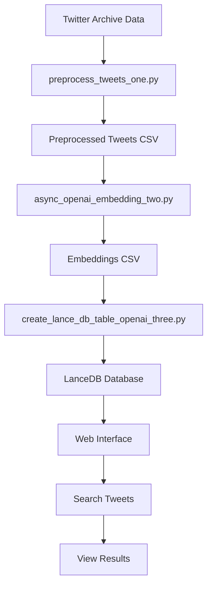

# SemanTweet Search

SemanTweet Search allows you to search over all your tweets from the Twitter archive using semantic similarity. A demo is available [here](https://x.com/dejavucoder/status/1770159894143946966?s=20).

It preprocesses your tweets, generates embeddings using **OpenAI's small/large embedding model**, stores the data and embeddings in LanceDB vector db, and provides a web interface to search and view the results.

You can do semantic search post **pre-filtering by time, likes, retweets, media only or link only** tweets too. 

Pre-filtering by sql operations helps not only filter but also reduce the vector search space thus speeding up the search.

You can additionally use/edit `projector.py` and [tensorflow projector ](https://projector.tensorflow.org/)to get a visualization of your tweets using t-sne algorithm as shown [here](https://x.com/dejavucoder/status/1771510768053186910?s=20)

**UPDATE** (24/3/2024)
Add support for CLIP based image searching on tweets_media folder. You can checkout the code in `app_image_search.py`.
LancedDb makes it easy to handle the embedding stuff.

WIP: adding bge-small-en-v1.5 support

**Technologies Used:**
- Twitter archive for data
- OpenAI embeddings for semantic search
- [Lancedb](https://lancedb.com/) for vector search and sql operations
- Hybrid search provided by Lancedb combining BM25 + embedding search
- Flask for server


## Prerequisites

- Python 3.x
- OpenAI API key
- Twitter archive data

## Installation

1. Clone the repository:

   ```
   git clone https://github.com/sankalp1999/semantweet-search.git
   ```

   ```
   cd semantweet-search/
   ```

2. Download your Twitter archive (takes 2 days to be available)

   Go to: `More (3 dot button) > Settings and Privacy > Your Account > Download an archive of your data`.

   Extract it. Put the extracted folder at the root of this project and rename it to `twitter-archive`.

3. Create a virtual environment:

   ```
   python3 -m venv venv
   ```

   Make sure you do this at the root of project.
4. Activate the virtual environment:

   - For Unix/Linux:
     ```
     source venv/bin/activate
     ```
   - For Windows:
     ```
     venv\Scripts\activate
     ```

5. Install the required dependencies:

   ```
   pip install -r requirements.txt
   ```

   If you are going to try out image based search, please run below. I have not included this in requirements.txt as it downloads
   as 620 MB model and not everyone would like to try.
   ```
   pip install open_clip_torch
   ```
6. Set up your OpenAI API key as an environment variable:

   ```
   export OPENAI_API_KEY=your_api_key
   ```

7. Choose the desired OpenAI embedding model (small or large) in the `openai/async_openai_embedding_two.py` file.

8. Run the setup script:

   ```
   chmod +x run_scripts.sh
   ./run_scripts.sh
   ```

9. Start the application:

   ```
   python app.py
   ```
   or
   ```
   flask run
   ```

Enjoy!

## Flow of the program




The OpenAI embedding flow consists of the following steps:

1. `preprocess_tweets_one.py`: This script preprocesses the tweets from the Twitter archive, extracting relevant information and saving it to a CSV file.

2. `async_openai_embedding_two.py`: This script reads the preprocessed tweets from the CSV file, generates embeddings using OpenAI's embedding model asynchronously, and saves the embeddings to a new CSV file.

3. `create_lance_db_table_openai_three.py`: This script reads the generated embeddings from the CSV file, creates a LanceDB table using the specified schema, and stores the data in the database.

The `run_scripts.sh` script automates the execution of these steps in the correct order.

## Additional Notes

- The project uses the `text-embedding-3-large` model by default. You can change the model by modifying the `MODEL_NAME` variable in the relevant scripts.

- The batch size for generating embeddings is set to 32 to stay within the token limit. Adjust the batch size if needed.

- The LanceDB database is stored in the `data/openai_db` directory.

- The project also includes a synchronous version of the OpenAI embedding generation script (`create_openai_embedding_sync_two.py`), which can be used as an alternative to the asynchronous version.

## License

This project is licensed under the MIT License. See the [LICENSE](LICENSE) file for details.